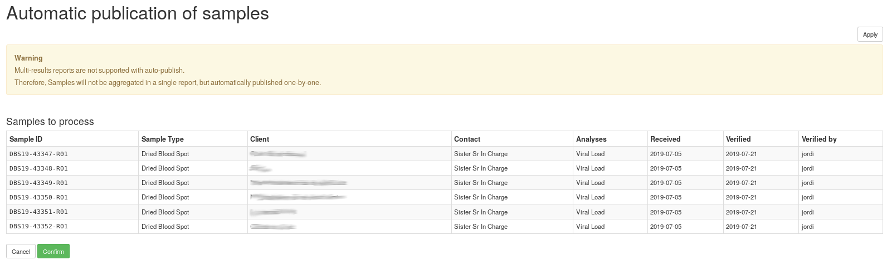

Quickstart
==========

This section gives an introduction about `senaite.autopublish`_. It assumes you
have `SENAITE LIMS`_ and senaite.autopublish already installed, with a reserved
zeo client listening at port 8089 and a regular zeo client listening at port 8080.
Please read the :doc:`installation` for further details.

Control panel
-------------

Visit the control panel view for senaite.autopublish to configure the settings.
This control panel is accessible to users with `Site Administrator` role,
through "Site Setup" view, "Add-on Configuration" section:

http://localhost:8080/senaite/@@autopublish-controlpanel

.. note:: It assumes you have a SENAITE zeo client listening to port 8080

Auto-publish samples
--------------------

Login as a SENAITE regular user with enough privileges to publish samples. Be
sure you have some samples in "verified" status. Go to Samples listing, and
click to the "Verified" filter button (at the top of the list). Select some
samples and a button "Auto publish" will be displayed at the bottom of the list.

Press the "Auto publish" button at the bottom and a confirmation view is displayed:

Once the "Confirm" button is pressed, the system delegates the publication
process of the selected samples to `senaite.queue`_. These samples will be
eventually published. Meanwhile, a progress icon is displayed next to them in
listings.

Monitoring
----------

You can keep track of the samples that are in the publishing queue from the
top-right "hamburger" menu, link "Queue Monitor":

http://localhost:8080/senaite/queue_tasks

From this view you can cancel the auto-publication of individual samples or
see the details of each task. Visit the `Documentation of senaite.queue`_ for
further details.

.. Links

.. _senaite.autopublish: https://pypi.python.org/pypi/senaite.autopublish
.. _senaite.queue: https://pypi.python.org/pypi/senaite.queue
.. _Documentation of senaite.queue: https://senaitequeue.readthedocs.io/en/latest/quickstart.html#queue-monitoring
.. _SENAITE LIMS: https://www.senaite.com
